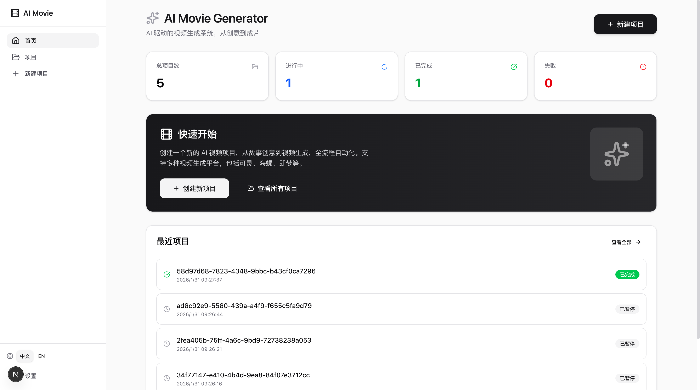
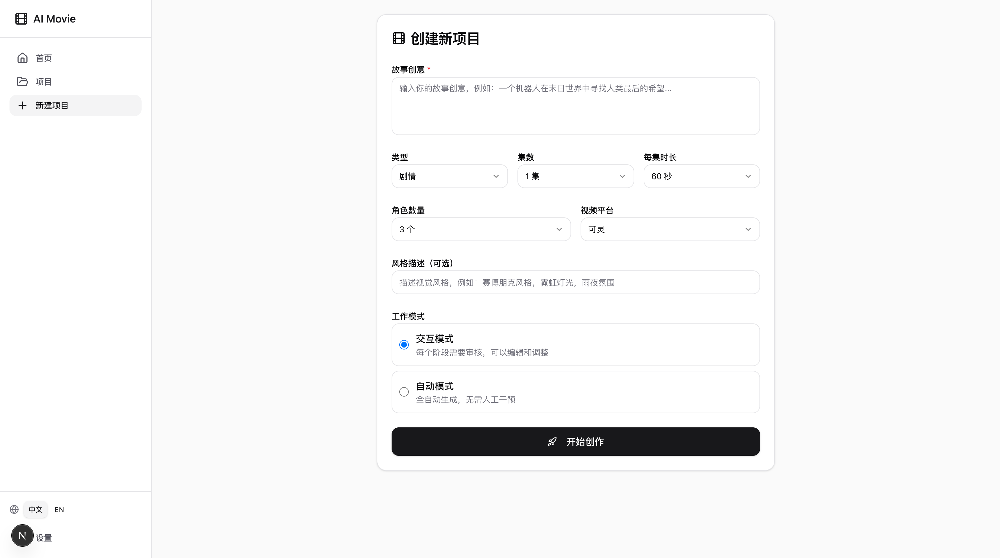
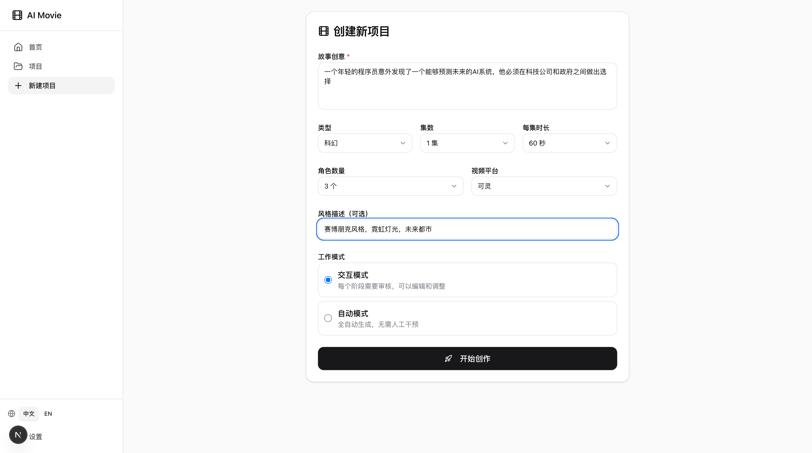
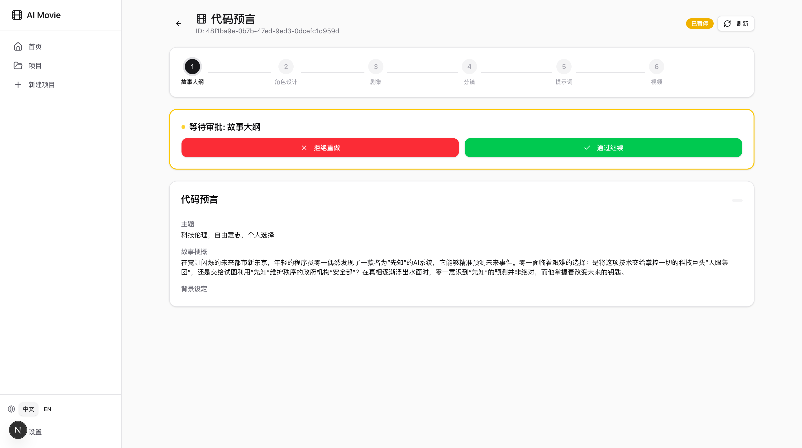
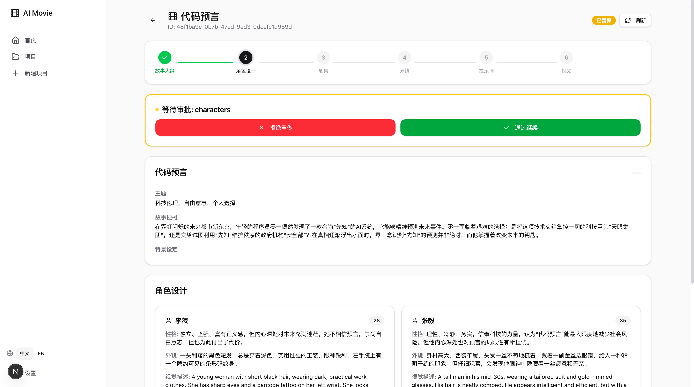
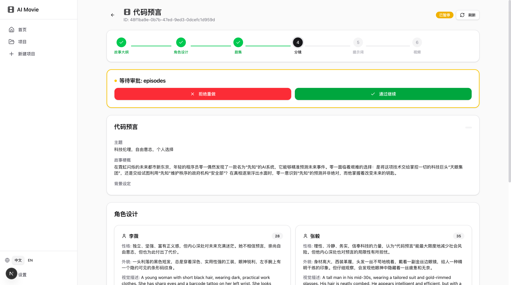
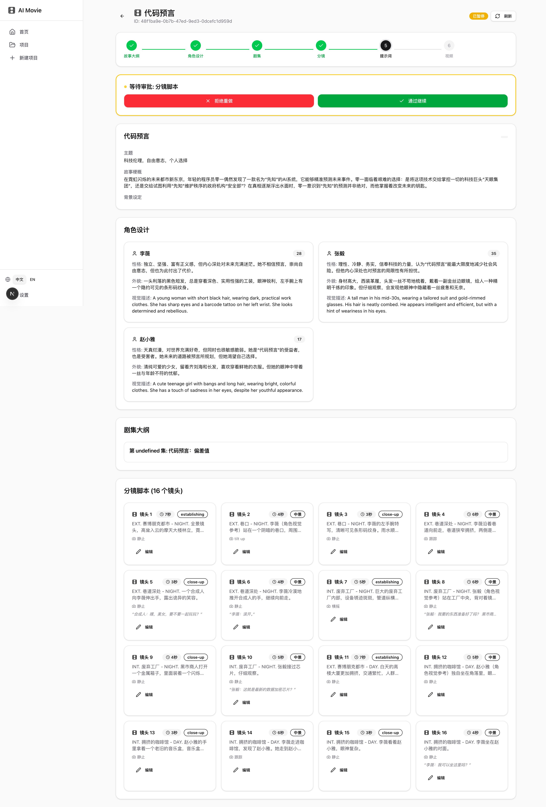
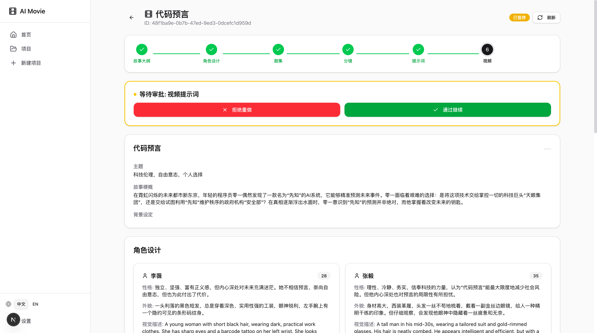
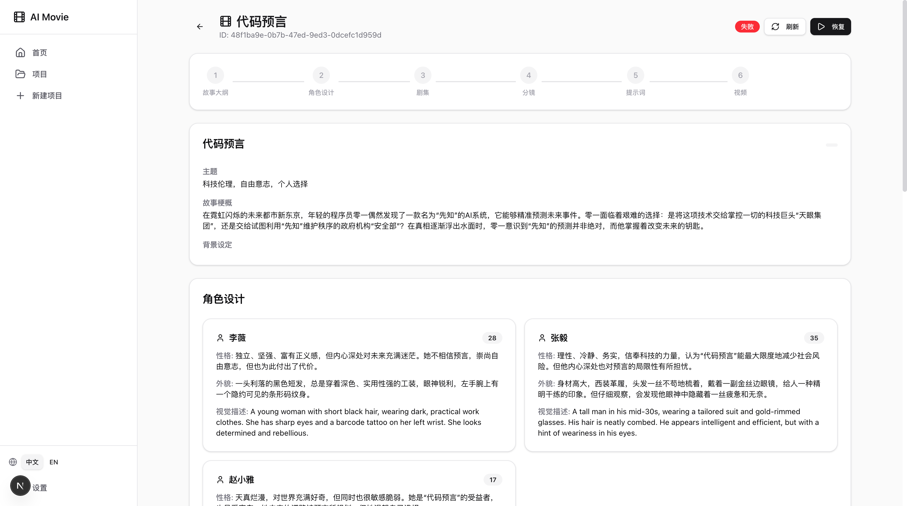
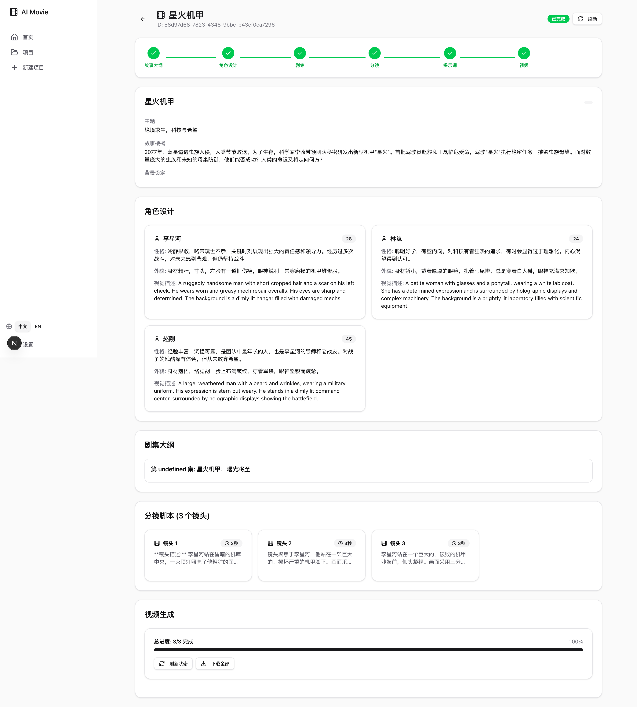

# AI Movie Generator

开源 AI 视频生成系统，支持从剧本创作到视频生成的完整工作流。

## 项目模块

| 模块 | 说明 | 文档 |
|------|------|------|
| **Video Comparison** | 多平台视频生成效果对比 (Streamlit) | [README](src/comparison/README.md) |
| **Story Generator** | AI 剧本生成平台 (Streamlit) | [README](src/story_generator/README.md) |
| **Image Generator** | AI 图像生成测试 (Streamlit) | [README](src/image_generator/README.md) |
| **Workflow CLI** | 多 Agent 工作流命令行工具 | [README](scripts/README.md) |
| **Web App** | 完整 Web 应用 (Next.js + FastAPI) | [README](web/README.md) |

## 支持的视频平台

| 平台 | 文生视频 | 图生视频 | 首尾帧 | 主体参考 |
|------|:--------:|:--------:|:------:|:--------:|
| 可灵 (Kling) | ✅ | ✅ | ✅ | ✅ |
| 海螺 (Hailuo) | ✅ | ✅ | ✅ | ✅ |
| 即梦 (Jimeng) | ✅ | ✅ | ❌ | ⚠️ |
| 通义万相 (Tongyi) | ✅ | ✅ | ❌ | ⚠️ |

## 支持的图像平台

| 平台 | 文生图 | 图像编辑 | 角色设计 | 帧生成 |
|------|:------:|:--------:|:--------:|:------:|
| 通义 (Tongyi/DashScope) | ✅ | ✅ | ✅ | ✅ |

### 角色设计功能

| 功能 | 说明 |
|------|------|
| 正面图生成 | 生成角色参考正面图 |
| 三视图生成 | 生成侧面/正面/背面三张独立图片 |
| 单张三视图 | 一张图包含三个视角 |
| 角色设定图 | 游戏风格的多角度转面图 |

详细文档: [Image Provider](docs/IMAGE_PROVIDER.md)

## 功能预览

### 1. 系统首页


### 2. 创作流程
> 支持从新建项目、填写需求、剧本审核到角色设计的完整链路

| 步骤 1: 新建项目 | 步骤 2: 填写需求 |
|:--:|:--:|
|  |  |

| 步骤 3: 剧本审核 | 步骤 4: 角色设计 |
|:--:|:--:|
|  |  |

| 步骤 5: 分集剧情 | 步骤 6: 分镜设计 |
|:--:|:--:|
|  |  |

| 步骤 7: 提示词生成 | 步骤 8: 视频生成 |
|:--:|:--:|
|  |  |

### 3. 完成效果


## 快速开始

### 环境配置

```bash
# 克隆项目
git clone https://github.com/your-repo/movie_generator.git
cd movie_generator

# 创建虚拟环境
python3.13 -m venv venv
source venv/bin/activate

# 安装依赖
pip install -r requirements.txt

# 配置 API Keys
export GEMINI_API_KEY="your-gemini-key"
```

### 视频平台配置

创建 `src/providers/config.local.yaml`:

```yaml
providers:
  kling:
    access_key: "your-access-key"
    secret_key: "your-secret-key"
  hailuo:
    api_key: "your-api-key"
```

### 运行各模块

```bash
# 1. 视频平台对比 (Streamlit)
./scripts/run_comparison.sh
# 或: streamlit run src/comparison/app.py --server.port 8501

# 2. 剧本生成器 (Streamlit)
./scripts/run_story_generator.sh
# 或: streamlit run src/story_generator/app.py --server.port 8502

# 3. 图像生成测试 (Streamlit)
./scripts/run_image_generator.sh
# 或: streamlit run src/image_generator/app.py --server.port 8503

# 4. CLI 工作流
python scripts/run_workflow.py start "一只小猫在阳光下打盹"
python scripts/run_workflow.py list
python scripts/run_workflow.py resume <session_id>

# 5. Web 应用
uvicorn api.main:app --port 8000 &  # 后端
cd web && npm run dev                # 前端
```

## 项目结构

```
movie_generator/
├── src/
│   ├── comparison/       # 视频平台对比模块
│   ├── story_generator/  # 剧本生成模块
│   ├── image_generator/  # 图像生成测试模块
│   ├── agents/           # 多 Agent 系统
│   ├── providers/        # AI 生成 Provider
│   │   ├── video/        # 视频生成 (Kling, Hailuo, Jimeng, Tongyi)
│   │   └── image/        # 图像生成 (Tongyi)
│   ├── skills/           # Agent 技能系统
│   └── mcp_servers/      # MCP 服务器
├── api/                  # FastAPI 后端
├── web/                  # Next.js 前端
├── scripts/              # CLI 脚本和启动脚本
├── docs/                 # 设计文档
└── api_doc/              # 平台 API 文档
```

## 测试

```bash
# Story Generator 测试
python scripts/test_story_generator.py

# Image Provider 基础测试
python scripts/test_image_provider.py

# Image Provider 角色视图测试
python scripts/test_character_views.py

# Agent 单元测试
python scripts/test_agents.py

# 会话管理测试
python scripts/test_session.py

# 端到端测试
python scripts/test_e2e.py

# MCP 服务器测试
python scripts/test_mcp_servers.py

# API 测试
python scripts/test_api.py
```

## 文档

- [需求文档](docs/REQUIREMENTS.md)
- [多 Agent 设计](docs/MULTI_AGENT_PLAN.md)
- [Web UI 设计](docs/WEB_UI_DESIGN.md)
- [Story Generator 详细文档](docs/STORY_GENERATOR.md)
- [Image Provider 详细文档](docs/IMAGE_PROVIDER.md)
- [E2E 测试报告](docs/E2E_TEST_REPORT.md)
- [平台 API 文档](docs/providers/)

## License

MIT
